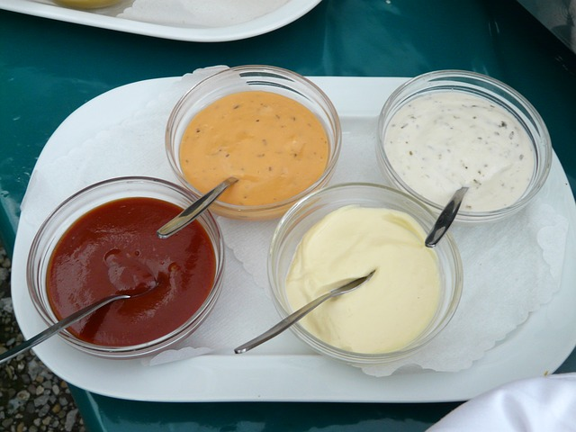

# Menu 

## PIZZE

|   Pizza:                                                                      |rozmiar: | 30cm | 50cm | 60cm |
|-------------------------------------------------------------------------------|---------|------|------|------|
|MARGHERITA  (mozzarella, oregano, sos pomidorowy)                              |         | 20zl | 40zl | 50zl |
|FUNGI (mozzarella, pieczarki, sos pomidorowy)                                  |         | 20zl | 40zl | 50zl |
|VESUVIO (mozzarella, szynka, sos pomidorowy)                                   |         | 22zl | 42zl | 52zl |
|CAPRICIOSA (mozzarella, szynka, pieczarki, sos pomidorowy)                     |         | 23zl | 43zl | 53zl |
|HAWANA (mozzarella, szynka, ananas, sos pomidorowy)                            |         | 24zl | 44zl | 54zl |
|PANCETTA (mozzarella, bekon, cebula, sos pomidorowy)                           |         | 26zl | 46zl | 56zl |
|PEPPERONI (mozzarella, salami, sos pomidorowy)                                 |         | 25zl | 45zl | 55zl |
|PROSCIUTTO (mozzarella, szynka parmeńska, rukola, sos pomidorowy)              |         | 22zl | 42zl | 52zl |
|CARBONARA (mozzarella, sos pomidorowy, sos carbonara)                          |         | 23zl | 43zl | 53zl |
|POLLO (mozzarella, gyros z kurczaka, cebula, oliwki, sos pomidorowy)           |         | 24zl | 44zl | 54zl |
|TONNO (mozzarella, tuńczyk, cebula, pieczarki, sos pomidorowy)                 |         | 28zl | 48zl | 58zl |
|WEGETARIAN (pieczarki, świeży pomidor, brokuły, oliwki)                        |         | 22zl | 42zl | 52zl |
|FRUTTI DI MARE (mozzarella, owoce morza, kapary, cebula, sos pomidorowy)       |         | 23zl | 43zl | 53zl |
|QUATTRO FORMAGGI (mozzarella, feta, camembert, lazur, sos pomidorowy)          |         | 23zl | 43zl | 53zl |
|MEXICANA (mozzarella, salami, jalapeno, kukurydza, sos pomidorowy)             |         | 22zl | 42zl | 52zl |
|SICILIANA (mozzarella, szynka, salami, pieczarki, cebula, sos pomidorowy)      |         | 25zl | 45zl | 55zl |
|HOT PEPPERONI (mozzarella, bekon, salami, jalapeno, cebula, sos pomidorowy)    |         | 26zl | 46zl | 56zl |
|FAMILIARE (mozzarella, bekon, ogórek kiszony, cebula, sos pomidorowy)          |         | 23zl | 43zl | 53zl |

## PIZZE VEGETARIANSKIE

|   Pizza:                                                                      |rozmiar: | 30cm | 50cm | 60cm |
|-------------------------------------------------------------------------------|---------|------|------|------|
|MARGHERITA vega (mozzarella, oregano, sos pomidorowy)                          |         | 20zl | 40zl | 50zl |
|FUNGI vega (mozzarella, pieczarki, sos pomidorowy)                             |         | 20zl | 40zl | 50zl |
|VESUVIO vega (mozzarella, parmezan, sos pomidorowy)                            |         | 22zl | 42zl | 52zl |
|CAPRICIOSA vega (mozzarella, oliwa, pieczarki, sos pomidorowy)                 |         | 23zl | 43zl | 53zl |
|HAWANA vega (mozzarella, ananas, sos pomidorowy)                               |         | 24zl | 44zl | 54zl |

## SAŁATKI 
 
 
|   Sałatka:                                                                                          | Waga: |  Cena: |
|-----------------------------------------------------------------------------------------------------|-------|--------|
|Sałatka Cezar (sałata, pomidorki cherry, ogórek, kurczak grillowany, ser Grangusto Galbani, sos)     | 230g  |  10zl  |
|Sałatka Grecka (sałata, pomidorki cherry, ogórek, ser śródziemnomorski, oliwki czarne, oregano, sos) | 240g  |  10zl  |
## DESERY

|   Desery:                            | Rodzaje                                                      | Pojemność: |  Cena: |
|--------------------------------------|--------------------------------------------------------------|------------|--------|
|Ben&Jerry's                           | Cookie Dough, Chocolate Fudge Brownie, Netflix & Chill'd     |   465ml    |  12zl  |
|Magnum                                | Almond                                                       |   440ml    |  12zl  |

## DODATKI
|   Dodatki:                            |  Cena: |
|---------------------------------------|--------|
|Pesto czerwone                         |   3zl  |
|Pesto zielone                          |   3zl  |
|Oliwy                                  |   3zl  |

## SOSY

|   Sosy   :                            |  Cena: |
|---------------------------------------|--------|
|Sos pomidorowy                         | 2,50zl |
|Sos czosnkowy                          | 2,50zl |                        
|Sos meksykanski                        | 2,50zl |
|Sos BBQ                                | 2,50zl |

## NAPOJE 

|   Napoje:                            | Pojemność: | 0,33L | 0,5L | 0,85L |
|--------------------------------------|------------|-------|------|-------|
|Pepsi                                 |            |  9zl  | 13zl | 18zl  |
|Mirinda                               |            |  9zl  | 13zl | 18zl  |
|7UP                                   |            |  9zl  | 13zl | 18zl  |
|Mountain Dew                          |            |  9zl  | 13zl | 18zl  |
|Woda Źródlana                         |            |       |  6zl |       |
|Lipton Ice Tea                        |            |       |  9zl | 15zl  |
|Sok Toma                              |            |  8zl  |      | 19zl  |
|Warka Radler 0%                       |            |       | 15zl |       |
|Piwo: Heineken, Żywiec, Warka         |            |       | 15zl |       |
|Red Bull                              |            |  9zl  |      |       |
